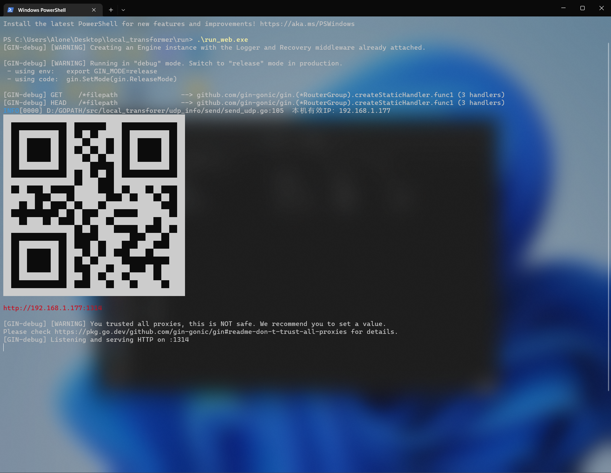
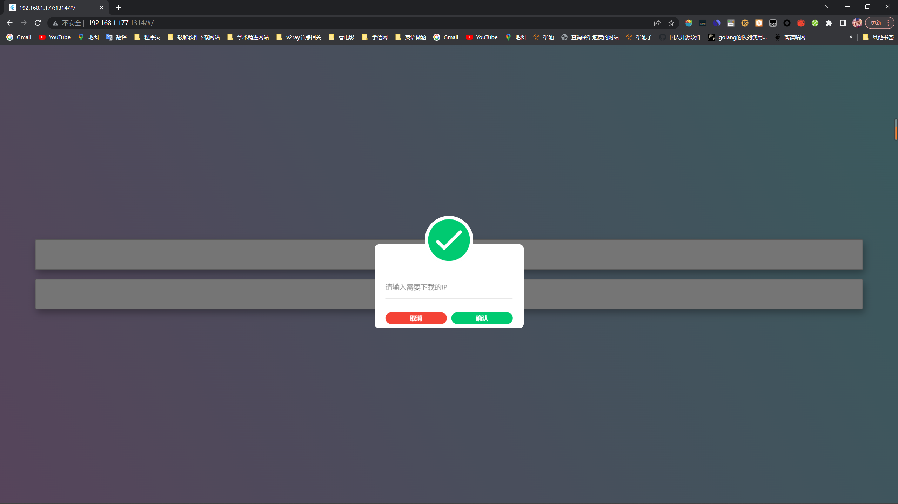
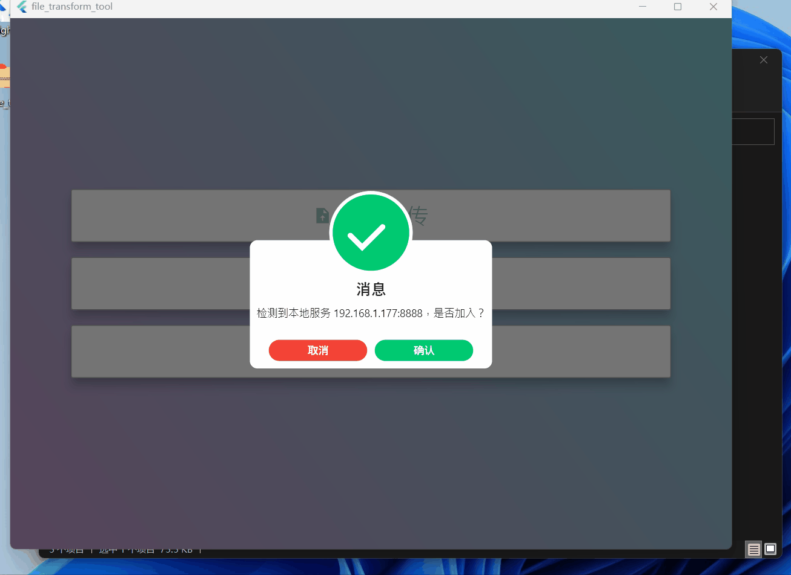

# LocalTransformer
> 不要被GitHub的评定给误导，该项目的实现和js没有任何关系，虽然web文件夹中有几万行js代码...，该项目是以go语言作为服务后台，flutter框架实现前台界面，本仓库为go的后端实现，当然也打包了web前端实现，由于相较于被功能的实现，后端的代码可能100行都不到（可能仅仅1小时不到就写完了），所以重点其实也是在flutter前端实现(至少对于我这个新手而言需要蛮久的，特别是状态管理方面)
## 如何使用
1. [下载压缩包](https://up.woozooo.com/mydisk.php)
2. 解压后得到压缩文件，[压缩文件具体层级说明](https://github.com/ACking-you/go-transform/releases/tag/1.0)
3. 运行 `run/run_web.exe` 使本机开启web服务，运行 `run/main.exe` 开启文件传输服务
> 说明：由于本软件的前端采取flutter编写，所以能够支持6端，但是flutter对web端的支持感觉不是很友好，本来打包一个web端就能解决文件上传和下载的功能，但是为了适配web端，疯狂出bug，我也不知如何解决，所以干脆就这样 -> web端支持下载功能，文件上传等功能则由对应平台的原生应用去实现（比如Windows的exe，安卓的apk等）。

## 使用效果
* 运行 `main.exe` 如下：（为本机开启文件传输的后台服务）

该服务启动后会每隔2s进行整个局域网子网的扫描，如果局域网下存在有人使用具体各端软件，那么他们会识别到该服务。
* 运行 `run_web.exe` 后如下：

桌面端可以通过下面的红色链接进入web界面，移动端可以通过链接也可以通过扫描二维码的方式进入。

* 进入web页面效果如下：

进入后会跳出一个输入框要你输入开启了文件传输服务的主机IP地址，如果想要下载目标主机的文件则输入目标主机的IP，如果不输入只需要点击外围空着的区域，则可免受该弹窗的骚扰，如果是点击取消则会再2s后继续提示你输入。
建议是直接跳过这个提示，点击第一个选项进行 `软件下载`。下载对应的原生应用，然后便可方便的传输文件了。当然如果仅仅是想要下载，那么web端也是可以满足的，刷新页面再次输入目标IP即可。
* Windows桌面端效果如下：
> 以下呈现了文件上传和下载

打开软件之后，会自动识别该子网内是否有开启服务，如果有，则会自动给出提示加入该文件服务器，然后文件的上传和下载服务都由该服务器实现。我们注意到桌面端是支持文件的拖拽上传的。

更多效果展示：

## 整体实现
后端思路：
1. 使用UDP进行定期端口消息扫描（每隔2s发送udp消息到整个子网进行服务的通知），确保软件一使用就能连接上对应的服务
2. 其余均用http实现简单的文件上传和传输服务（这个go只需要一行代码实现文件下载服务，上传服务也不超过20行...

该项目的意义：
* 在很多情况下我有电脑和手机文件互传的需求（而每次都是使用的QQ），既然每次都是同一个局域网，那么何不自己写个软件来实现，何况QQ还限速...
* 本来就正在做一个即时通讯的软件，文件传输功能也是该软件的一环，正好先把其中的模块一个个完成（主要是前端界面）正好这里的前端实现可以继续复用...